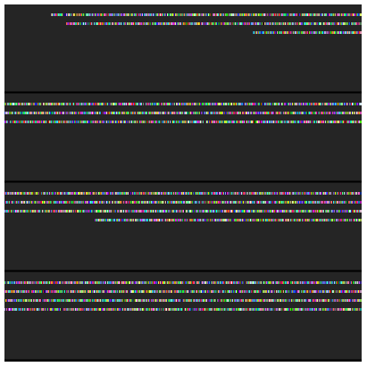
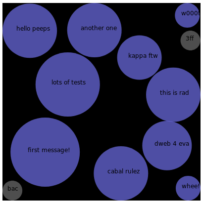

# cabal-p5js

An interface between [cabal]() and [p5js]() for simple visualizations.

## Installation

`npm install`

## Usage

First, the peer sockets server using:

`node node peersocket.js --cabal [cabal key]`

Or use the included script:

```
chmod a+x invoke.sh
./invoke.sh
```

Then, try one of the examples in the `examples` folder.

For example:


### Waterfall



With `peerserver` running as above, use a browser to open the `index.html` file in the folder `examples/waterfall`.  The visualization will proceed in a 'lawnmower' fasion across the screen, with colorful lines appearing when new peers are added to the swarm.

### Bubbles


In `examples/bubbles`, open `index.html` in a browser.  Peers should appear as small circles; and as you write messages to the cabal, you should seem them appear as larger circles:




